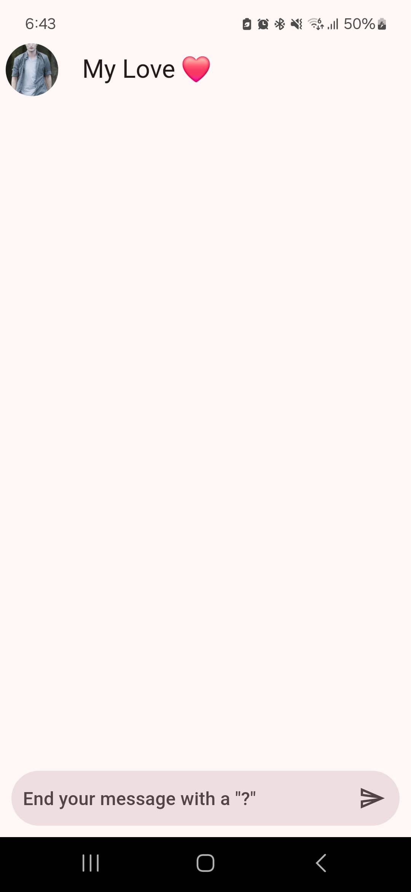
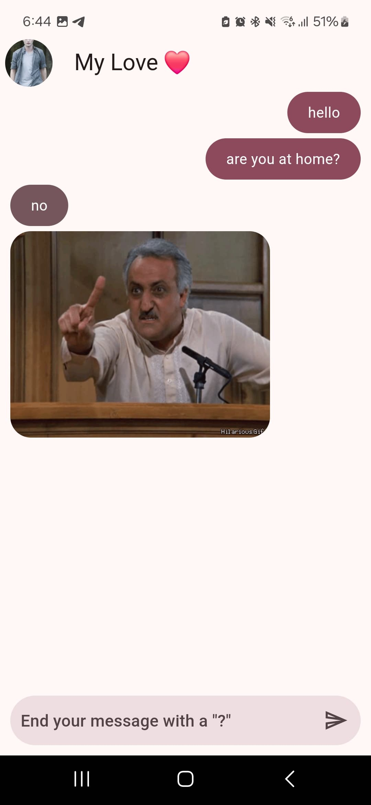

# Flutter Chat App - Yes or No GIF

Welcome to the "Yes or No GIF" chat app! This is a basic Flutter application that allows you to send a question and receive an animated GIF responding with a "Yes" or "No".

## Features

- **Simple Interface**: A clean and easy-to-use user interface.
- **GIF Responses**: Receive an animated GIF as a response to your question.
- **API Integration**: Uses an external API to fetch "Yes" or "No" GIFs.
- **Clean Architecture**: The app follows a basic structure inspired by Clean Architecture principles.

## Screenshots




## Requirements

- Flutter SDK (version 3.0.0 or higher)
- Dart (version 2.17.0 or higher)
- Internet connection (to fetch GIFs)

## Installation

1. **Clone the repository**:
   ```bash
   git clone https://github.com/your-username/flutter-chat-app.git
2. **Navigate to the project directory**:
   ```bash
   cd flutter-chat-app
3. **Install dependencies**:
   ```bash
   flutter pub get
4. **Run the app**:
   ```bash
   flutter run
## Usage

1. Open the app on your device or emulator.
2. Type your question in the text field.
3. Press the "Send" button.
4. Receive an animated GIF responding with a "Yes" or "No"!

## Project Structure (Clean Architecture Inspired)

The app follows a basic structure inspired by Clean Architecture, separating concerns into layers:

```
YES_NO_APP/
├── lib/
│ ├── main.dart         # Entry point of the application
│ ├── config/           # Configuration and utilities
│ │ ├── theme/          # App theme (colors, fonts, etc.)
│ │ └── helpers/        # Helper functions and utilities
│ ├── infrastructure/   # Infrastructure layer (data sources and models)
│ │ └── models/         # Data models (e.g., API response models)
│ ├── domain/           # Domain layer (business logic)
│ │ └── entities/       # Business entities (core data structures)
│ ├── presentation/     # Presentation layer (UI and state management)
│ │ ├── screens/        # App screens (pages)
│ │ ├── widgets/        # Reusable UI components
│ │ └── providers/      # State management (using Provider)
├── assets/             # Static assets (e.g., images, fonts)
├── test/               # Unit and widget tests
└── pubspec.yaml        # Project dependencies
```

### How the Layers Work Together:
1. **`domain/entities/`**: Define the core business entities (e.g., `Answer` with a `gifUrl` field).
2. **`infrastructure/models/`**: Map API responses (or other data sources) to the domain entities (e.g., `AnswerModel`).
3. **`presentation/providers/`**: Use `Provider` to manage app state (e.g., `ChatProvider` handles sending questions and receiving answers).
4. **`presentation/screens/`**: Display the UI and interact with the state managed by the providers.
5. **`config/`**: Provides global configurations and utilities used across the app.


---

This structure ensures a clean separation of concerns, making the app easier to maintain, test, and scale.

## Dependencies

- [dio](https://pub.dev/packages/dio): A powerful HTTP client for Dart, used for making API requests.
- [provider](https://pub.dev/packages/provider): A state management library for Flutter, used to manage and share app state efficiently.

## Contributing
Contributions are welcome! If you have any ideas to improve the app, please open an issue or submit a pull request.
